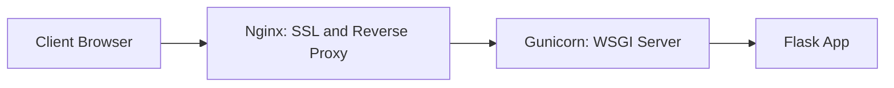

# 🛠️ Refael Designs Website - [**Live Website/האתר באוויר**](https://refael-d.co.il)

This is a business website developed for **Refael Designs**, a professional carpentry and furniture business.  
The website showcases the company's work, includes a gallery, contact form, and is optimized for SEO and accessibility.

---

## 🌐 Website Overview

- **Homepage** with key service highlights
- **Gallery page** featuring photos of completed carpentry projects
- **Terms page** with accessibility information and policies
- **Contact form** integrated with Formspree for direct client inquiries
- **Mobile-friendly** and fully responsive design

---

## 🧱 Tech Stack

| Area            | Tech Used                               |
|-----------------|-----------------------------------------|
| Structure       | HTML5                                   |
| Styling         | CSS3                                    |
| Interactivity   | JavaScript                              |
| Backend         | Python with Flask                       |
| Hosting         | AWS EC2                                 |
| Domain & DNS    | Route 53 (AWS)                          |
| Reverse Proxy   | Nginx                                   |
| SSL             | Let's Encrypt                           |
| Forms           | Formspree API                           |
| CI/CD           | GitHub Actions (auto-deploy to EC2)     |

---

## 🔄 Request & Deployment Flow

This diagram shows how requests and deployments are handled in production:

### Request Flow


### Deploy Flow
```
    subgraph Deploy[CI/CD Pipeline]
    E[GitHub Repo] --> F[GitHub Actions: CI/CD Workflow]
    F --> G[EC2 Server: git pull + restart service]
    end
```

---

## 📂 Project Structure
```
Refael-Designs-Website/
│
├── static/
│   ├── css/ → Custom stylesheets
│   ├── js/ → JavaScript functions
│   └── imgs/ → Website and gallery images
│
├── templates/
│   ├── index.html → Homepage
│   ├── gallery.html → Gallery section
│   └── terms.html → Terms & accessibility info
│
├── deploy/ → Example deployment configs (not part of the actual website)
│   ├── service.example → systemd service example
│   └── nginx.conf.example → Nginx server block example
│
├── server.py → Flask server for routing and form handling
├── .github/workflows/deploy_to_website.yml → GitHub Actions workflow for CI/CD
├── .gitignore
└── .env → Environment variables (e.g., Formspree URL)
```
---

## 📷 Example Screenshots


---

## ⚙️ Deployment Configuration (Examples)

This repository includes both example configuration files and a production-ready CI/CD workflow:

- `deploy/service.example` → Example **systemd service file** for running the Flask app with Gunicorn.  
- `deploy/nginx.conf.example` → Example **Nginx server block** for reverse proxy + SSL (Let's Encrypt).  
- `.github/workflows/deploy_to_website.yml` → GitHub Actions workflow that automates deployment:
  - On every push to main, GitHub connects to the EC2 server via SSH.
  - Pulls the latest code from GitHub.
  - Installs dependencies.
  - Restarts the Flask/Gunicorn service.

**Important Notes**:  
- Example files under `/deploy` are templates only. 
- Production CI/CD (`deploy_to_website.yml`) is actively used and maintained.
- Before using them, update the following parameters according to your setup:  
  - Paths (`/home/ubuntu/...`)  
  - Domain name (`refael-d.co.il`)  
  - Ports (e.g., `8000`)  
  - Python environment (virtualenv)  
- SSL certificates (`/etc/letsencrypt/...`) are generated uniquely per server/domain and must be obtained separately.
